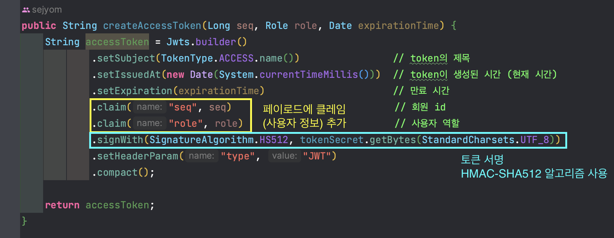
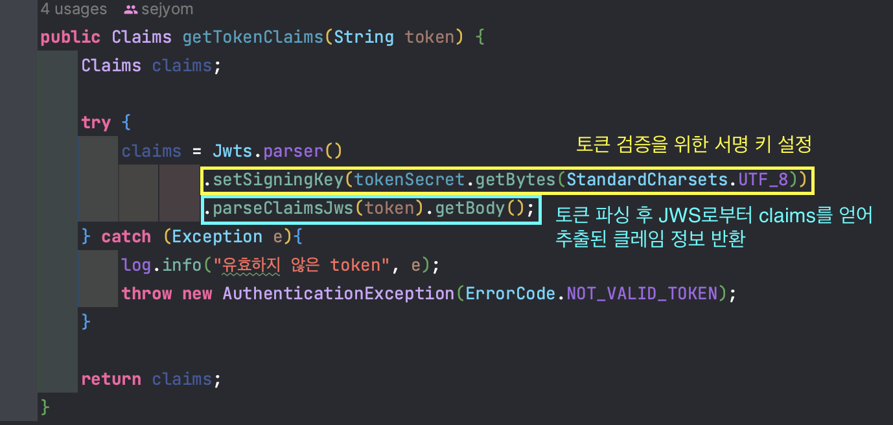
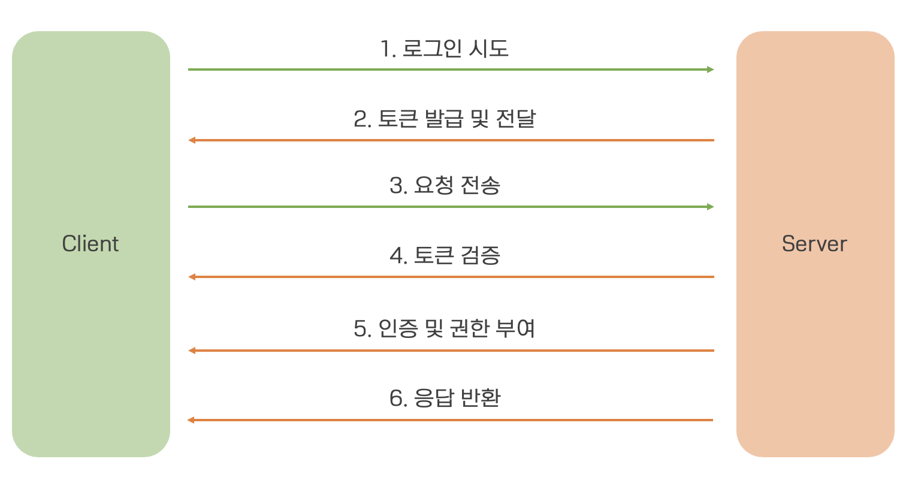

# 인증/인가(Authentication/Authorization)

# JWT(JSON Web Token)
> 웹 표준으로 정보를 안전하게 전달하기 위한 경량화된 방법 중 하나로, 일반적으로 사용자의 인증과 관련된 정보를 담고 있음.

## 다양한 인증 방식

### 세션 기반 인증 (Session-Based Authentication)
> 초기에 주로 사용되었던 인증 방식 중 하나로, 사용자의 로그인 상태를 서버 측에서 유지 및 관리하는 방식.

#### 장점

- 서버에서 세션을 관리하므로 보안면에서 좋음
- 로그아웃 및 세션 만료 관리가 용이

#### 단점

- 서버 측에서 상태를 유지해야 함으로 확장에 제약
- 상태 관리를 위한 추가적인 자원(DB, 메모리 공간 등)이 필요

#### 사용 상황
- 작은 규모의 서비스나 간단한 웹 어플리케이션
- 상태 관리가 필요한 경우

<br>

### HTTP 기본 인증 (Basic Authentication)
> 사용자 이름과 비밀번호를 요청 헤더에 인코딩하여 서버에 전송하는 인증 방식.

#### 장점

- 간단하고 쉽게 구현 가능
- HTTP 헤더에 직접 인증 정보를 전송하여 사용 가능

#### 단점

- 사용자 이름과 비밀번호가 매 요청마다 전송되어 보안에 취약
- Base64로만 인코딩되어(암호화x) 안전면에서 보장되지 않음

#### 사용 상황

- 간단한 인증이 필요한 경우
- 보안 수준이 낮고 중요한 정보를 다루지 않는 경우

<br>

### 토큰 기반 인증 (Token-Based AUthentication)
> 보다 안전하고 확장성 있는 인증 방식으로, 서버에서 토큰을 발급하여 클라이언트가 이를 전달하고 이를 통해 인증을 수행하는 방식.

#### 장점

- 서버의 상태를 유지할 필요가 없음
- 확장성이 뛰어나고 분산 시스템에서 용이

#### 단점

- 토큰을 저장하기 위한 추가적인 메커니즘 필요
- 토큰이 조작되지 않았는지 검증할 필요가 있음

#### 사용 상황

- 분산 시스템이나 모바일 애플리케이션
- 상태를 서버에 유지하기 어려운 경우

<br>
<hr>

## JWT의 구성 요소

### 헤더 (Header)
> **JWT의 유형 및 해싱 알고리즘 정보를 포함.**

```json
{
  "alg": "HS256", //서명을 위한 해싱 알고리즘
  "typ": "JWT" //토큰 타입 지정
}
```

<br>

### 페이로드 (Payload)
> **토큰에 포함되는 정보.**<br>
> 클레임(Claim)이라고 불리는 키-값 쌍으로 구성되며, 토큰 내용을 설명 및 식별에 사용.

```json
{
  "sub": "access", //토큰 제목
  "name": "sejyom", //사용자 이름
  "role": "admin" //역할
}
```

#### 클레임의 종류


: 토큰의 내용을 정의하고 해당 정보를 통해 어떤 목적으로 사용되는지를 명확하게 설명함.

| 종류                        | 설명                                                  |
|---------------------------|-----------------------------------------------------|
| **Registered Claims**     | **토큰의 기본 정보, 표준적으로 사용.**                            |
| 'iss' (Issuer)            | 토큰 발급자                                              |
| 'sub' (Subject)           | 토큰의 주제                                              |
| 'aud' (Audience)          | 토큰 대상자                                              |
| 'exp' (Expiration)        | 토큰 만료 시간                                            |
| 'nbf' (Not Before)        | 토큰 활성화 시간                                           |
| 'iat' (Issued At)         | 토큰 발급 시간                                            |              
| 'jti' (JWT ID)            | JWT의 고유 식별자를 나타냄                                    |
|                           |                                                     |
| **Public Claims**         | **URI 형식으로 정의되며, 클레임의 충돌을 방지하기 위해 URL을 통해 이름을 정의.**     |
| 'http://sejyom.com/claim' | 예시                                                  |
|                           |                                                     |
| **Private Claims**        | **서버와 클라이언트 간 협의하여 사용하는 클레임, 공개적으로 정의되지 않은 사용자 지정 정보.** |
| 'customClaim'             | 예시                                                  |

<br>

### 서명 (Signature)
> **토큰의 무결성을 보호하고 변조를 방지하기 위한 부분으로, 서버에서 토큰의 유효성을 검증하는 데 사용.**<br>
> 헤더와 페이로드 내용과 서버에서 알고 있는 비밀 키를 사용하여 생성.

#### 서명 생성 과정

1. 헤더와 페이로드 준비 (Header and Payload Prepation)
- JSON 형식의 헤더와 페이로드 데이터를 Base64 인코딩을 거쳐 URL 안전 문자셋(+)과 같은 문자들을 치환하여 변환.
2. 서명 생성
- 서명은 헤더와 페이로드, 서버에서 알고있는 비밀 키를 사용하여 생성됨.
- 서명은 특정 알고리즘(HMAC, RSA 등)을 통해 만들어지며, 알고리즘에 따라 서명 방법이 달라짐.
3. 서명 추가
- 생성된 서명을 토큰 마지막 부분에 추가.
- 서명 부분은 헤더와 페이로드를 Base64로 인코딩한 것과 함께 .(dot)으로 구분되어 토큰을 완성함.
- ex) `Header.Payload.Signature`

<br>

다음은 프로젝트에 사용한 토큰 생성 메서드이다.


다음은 JWT 토큰에서 클레임을 가져오는 메서드이다.

> 헤더와 페이로드를 준비하고, 서명을 생성하여 토큰에 추가함으로써 JWT는 정보의 **무결성을 보호**하고, **토큰의 변조를 방지**할 수 있다.

<br>
<hr>


## JWT 인증 과정


1. **로그인**: 사용자가 자격 증명(ID/PW)을 제출하여 로그인을 시도.
2. **토큰 발급 및 전달**: 서버는 사용자의 자격을 확인하여, 유효하면 JWT를 생성 후 클라이언트에 전달.
3. **요청 전송**: 서버에 요청을 보낼 때, JWT를 함께 전송.
4. **토큰 검증**: 수신된 JWT를 검증하여 서명을 확인하고, 만료 여부를 확인하여 유효한지 판단.
5. **인증 및 권한 부여**: 유효한 토큰이면, 토큰에 포함된 클레임 정보를 확인하여 사용자를 인증하고 권한을 부여.
6. **응답 반환**: 요청에 대한 응답을 클라이언트에 반환. 이 때, 유효성 검사에 실패하거나 권한이 없는 경우, 에러 메시지 또는 적절한 상태 코드 반환.

<br>
<hr>

## JWT의 장단점

### 장점

1. 간결성 및 자가수용적(Self-Contained): 정보를 자체적으로 포함하고 있어 별도의 DB 조회 없이도 필요한 정보를 읽을 수 있음.
2. 유연성과 확장성: 클레임을 이용해 사용자 정의 데이터를 넣을 수 있고, 토큰이 JSON으로 구성되어 있어 다양한 환경에 적용하기 용이.
3. 분산 환경에 유용: 토큰 기반 인증 방식으로 여러 서비스 간 통합되는 데 용이하며, 분산된 아키텍처에서도 활용도가 좋음.
4. 암호화 필요성의 감소: 토큰에 서명을 추가하여 무결성을 보장하므로, 추가적인 서버 자원 및 암호화 작업에 대한 부담을 줄일 수 있음.

### 단점

1. 크기 제한: 클라이언트와 서버 간의 전송에 사용되기 때문에, 페이로드에 저장되는 정보가 많아질수록 토큰 크기가 증가함. 이는 네트워크 대역폭을 증가시키고, 저장 및 전송 비용이 많이 들 수 있음.
2. 보안 취약성: 토큰이 클라이언트에 저장되는 경우, XSS 공격에 취약할 수 있음.
3. 세션 관리의 어려움: 자체적으로 세션을 관리하지 않기 때문에, 토큰의 만료 및 블랙리스트 관리에 대한 추가 작업 필요.
4. 보안과 관리: 토큰 취소/변경 기능이 내장되어 있지 않기 때문에, 토큰이 노출되면 만료되기 전까지 대응이 어려울 수 있음.
5. 불변성: 한 번 발급된 JWT 클레임 데이터는 변경되지 않으므로, 클레임 정보를 변경하려면 새로이 토큰을 발급해야 함.
